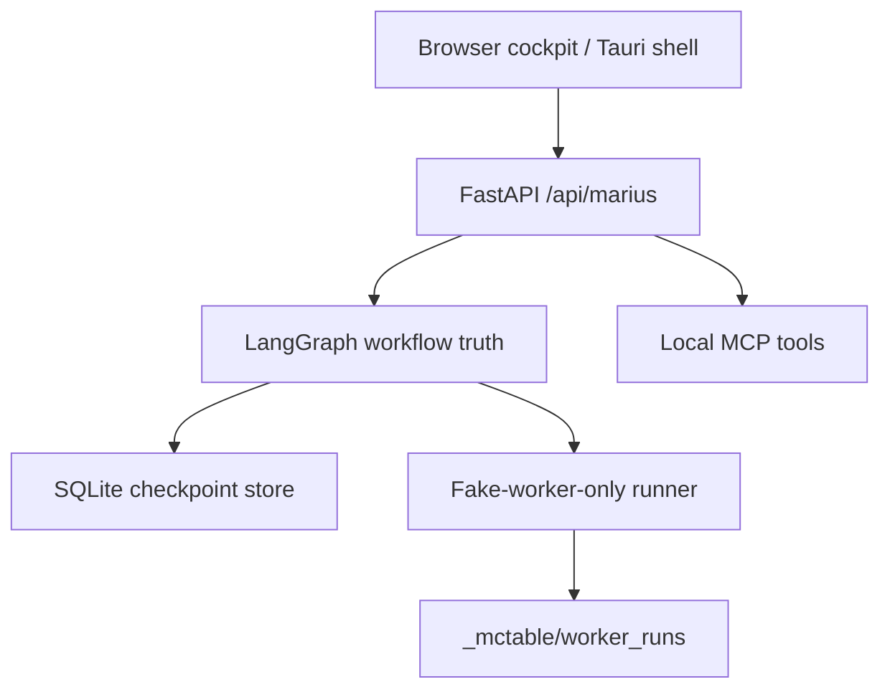

# Architecture

McHarness is a local-first harness for supervised AI work. The UI is thin; the backend owns workflow truth.

## Layers

## Behavior

- The backend owns task state, worker runs, logs, and checkpoint persistence.
- The UI reads real API state instead of inventing fake task data.
- Captain Mode models supervised agentic work with prompt queues, bounded minions, evidence, hard gates, human review, and scoped commits.
- Unsafe legacy launch routes stay disabled.
- Real external agent launch remains disabled.
- Arbitrary command execution remains disabled.
- Unknown commands are rejected through the same allowlist in the API and MCP paths.

