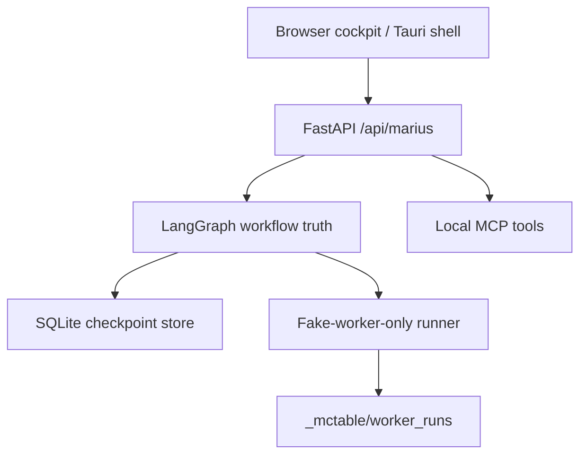

# Architecture

McHarness is a local-first harness for supervised AI work. The UI is thin; the backend owns workflow truth.

## Layers

## Behavior

- The backend owns task state, worker runs, logs, and checkpoint persistence.
- The UI reads real API state instead of inventing fake task data.
- Captain Mode v0.2 adds a deterministic state machine with prompt queues, bounded minions, evidence requirements, proof gates, human approval, and safe continuation.
- Workbench Core is a separate local metadata layer for agents, threads, messages, skills, memories, artifacts, tools, and safety profiles.
- The public cockpit uses the friendly thread contract (`title` + `goal`) and friendly message contract (`role` + `kind: instruction`) while the backend still blocks `command_request`.
- Run Ledger v0.1 layers runs, run events, evidence records, proof gates, approval decisions, and safe-noop continuation on top of the same local workbench store.
- Captain Mode state machine runs are created from workbench threads and emit run-ledger events for intake, planning, queueing, assignments, and proof gates.
- Unsafe legacy launch routes stay disabled.
- Real external agent launch remains disabled.
- Arbitrary command execution remains disabled.
- Unknown commands are rejected through the same allowlist in the API and MCP paths.
