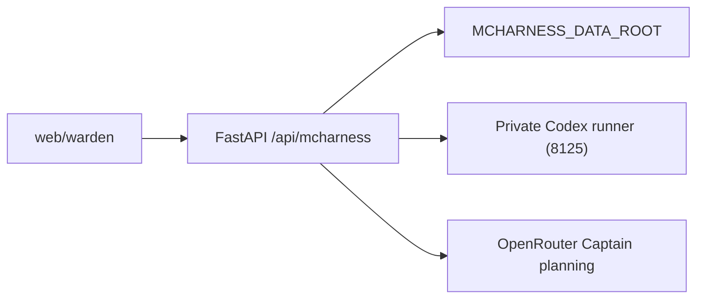

# Warden architecture

```mermaid
flowchart LR
  UI["web/warden"] --> API["FastAPI /api/mcharness"]
  API --> Store["MCHARNESS_DATA_ROOT"]
  API --> Codex["Private Codex runner (8125)"]
  API --> Captain["OpenRouter Captain planning"]
```

- **Warden** — operator control room UI
- **McHarness** — engine namespace (`/api/mcharness`)
- **Marius Systems** — product studio